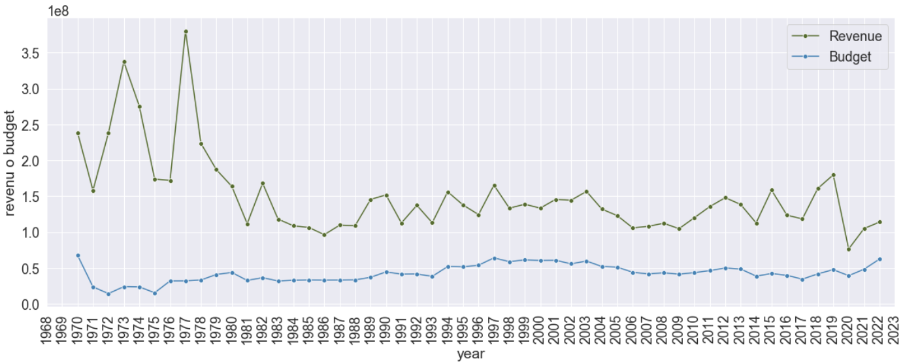

# EDA_ML
Análisis Exploratorio de Datos de películas estrenadas entre 1970-2022 y construcción de modelos Machine Learning para predecir el ingreso de taquilla de una película. El dataset con el que se realizó el estudio cuenta con aproximadamente 5000 películas.

Segundo gran proyecto realizando durante el Bootcamp de Data Science en The Bridge, en el que se realizo por medio de scripts de Python y diferentes Notebooks. Además de una analisis explotario del dataset de información de las películas, el objetivo principal de este proyecto se basa en el entrenamiento y evaluación de diferentes modelos de Machine Learning para predecir el ingreso de taquilla de una película según unas features.

La información se obtuvo por medio de una request a la API de la página [themoviedb](https://www.themoviedb.org/?language=es-ES); por otro lado, en el proyecto se utilizaron otros datasets (tipo csv), en el que se agregó información como el índice de precios al consumidor para inflar todas aquellas cifras de dinero al año 2022, también información sobre el número de nuevos muertos, infectados y vacunados por COVID-19. Para el tratamieento, limpieza, tranformación y visualización de variables se utilizaron librerías commo pandas, numpy, seabor y matplolib. A continuación se observa un lineplot en el que se observa los ingresos y presupuesto promedio de las películas que se lanzaron o estrenaron desde el año 1970 hasta lo que lleva a Abril del 2022.

